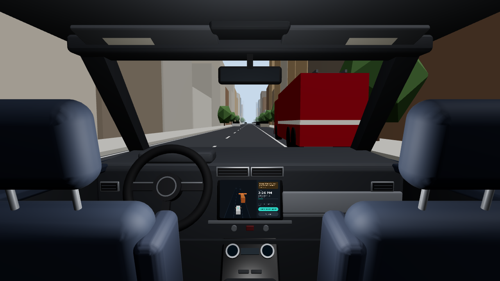
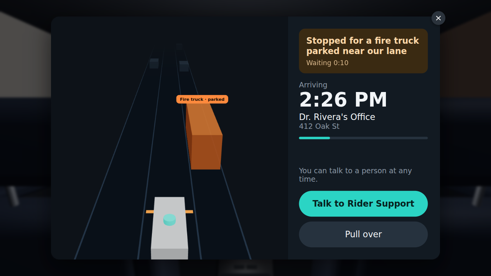

# AV ride-disruption prototype

A web prototype for testing how passengers feel when an autonomous ride (Waymo) is
disrupted, and whether in-car design can turn "helpless waiting" into "feeling in control".

This is the **feasibility spike**. It answers three questions:

1. Can we simulate an unexpected situation? → a scripted, facilitator-controllable scenario
2. Can web tech (React Three Fiber) carry the in-car experience? → a 3D back-seat view of the car's interior and the street, with the cabin screen live on the dashboard
3. Can users click through designed screens and see the outcome? → coded screens and Figma frames whose buttons change what the car does



Tap the centre screen to open it full size and use it:



## Run it

```bash
npm install
npm run dev        # http://localhost:5173
npm test           # engine + scenario checks
npm run build      # production build (deploys as-is to Vercel)
```

## Screens (routes)

| Route | What | Who sees it |
|---|---|---|
| `/` | **Lab**: every screen at once on one laptop | you, while building |
| `/control` | Facilitator console: start/pause, Rider Support chat, "Clear to proceed", observation markers, log export | facilitator only |
| `/world` | In the car, from the back seat: interior, street, and the cabin screen on the dashboard (tap it to open it). Put on a TV or big monitor | participant |
| `/cabin` | 1280×800 cabin screen (put on a tablet) | participant |
| `/phone` | Rider's phone app | participant |

`/control` (or `/`) runs the simulation; the others mirror it. The car's voice plays from `/world`. For a test session open
`/control` in one window and the participant screens in **other windows** of the same
browser (multi-device needs the WebSocket relay; see `docs/architecture.md`). Only one
`/control` or `/` at a time.

Keyboard / physical buttons on participant screens: **H** = help, **P** = pull over
(`src/config/keys.ts`). Any USB button that types those keys works.

## The spike scenario: parked fire truck

A fire truck is parked at the curb (no emergency, not blocking). The car stops anyway and
waits until the facilitator clicks **Clear to proceed**, Rider Support replies with a
clearance, or `maxWaitSeconds` passes. Then it eases around the truck and continues.

## Changing things

| I want to… | Edit | Notes |
|---|---|---|
| Change timings, wait length, screen text or voice lines | `src/scenarios/parked-fire-truck.ts` | No coding. Saves reload the app. |
| Make a new scenario | copy a file in `src/scenarios/` | Appears in the Scenario menu on `/control`. Reference: `docs/scenarios.md` |
| Change a cabin screen's layout or features | `src/surfaces/cabin/variants/*.tsx` | React. Read state with `useSim()`, send actions with `useRiderAction()` |
| Add a cabin design to compare | copy a file in `src/surfaces/cabin/variants/` | Appears in the Cabin design menu automatically |
| Test a Figma frame | `src/designs/<name>/design.ts` + exported images | See `src/designs/sample-figma/design.ts`. Add `?hotspots` to the URL to see hotspots |
| Change the phone app | `src/surfaces/phone/PhoneApp.tsx` | |
| Add a new *kind* of event (a swerve, a pedestrian…) | `src/engine/` + `src/surfaces/world/` | Needs code |
| Change the 3D street | `src/surfaces/world/WorldView.tsx` | |
| Change the car's interior or the seat position | `src/surfaces/world/Interior.tsx` | `EYE` is the passenger's eye position |

`npm test` plays every scenario with every cabin design to catch broken edits.

## Running a session

1. Open `/control`; pick scenario, cabin design and participant ID.
2. Open `/world` (and optionally `/cabin` on a tablet, `/phone`) in separate windows on the participant's screens; tap each to begin (enables sound and full screen). With one screen, `/world` alone is enough: the participant taps the dashboard screen to open it.
3. **Start**. Play Rider Support and fleet response from the console; tap observation markers (anxiety 1–7 etc.) as you watch.
4. **Export CSV/JSON** at the end: every scenario event, rider tap (including opening/closing the dashboard screen, and which screen a tap came from) and marker, time-stamped.
5. **Reset** for the next participant or design.

Design decisions and how the pieces fit: [`docs/architecture.md`](docs/architecture.md).
